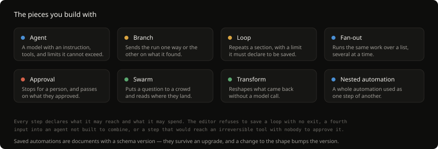
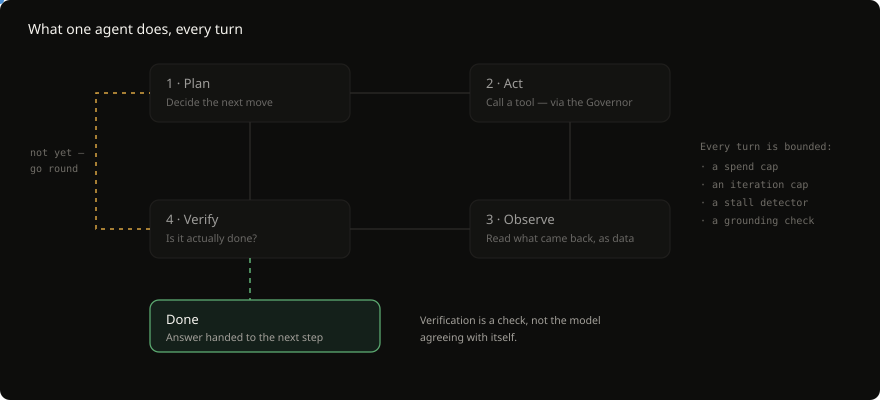
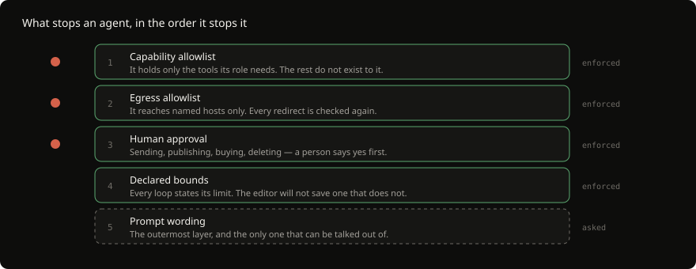

<div align="center">



<br>

[](#install)
[](#install)
[](#install)

[](https://electronjs.org)
[](https://typescriptlang.org)
[](https://sqlite.org)
[](https://modelcontextprotocol.io)
[](#your-data)
[](#project-status)

**[Install](#install)** · **[Requirements](#requirements)** · **[Updating](#updating)** · **[Uninstalling](#uninstalling)** · **[How it works](#how-it-works)** · **[Safety](#what-stops-an-agent)** · **[Built with](#built-with)** · **[FAQ](#frequently-asked)**

</div>

---

## What CHIMERA is

A **desktop application for putting teams of AI agents to work on real jobs.**

You join agents together on a canvas, point them at a task, and press run. Each
agent is a model with an instruction, a set of tools, and limits it cannot
exceed. What one finds, the next one gets. Every model call and every tool call
passes through a governor that can refuse it, and everything that happened is
written down.

It runs on your machine. Your workflows, runs, traces and API keys stay in a
local database and an OS keychain — there is no CHIMERA server, no account, and
nothing is sent anywhere except the model calls you configure. Point it at
Ollama and nothing leaves at all.

> **Early access, v0.1.0.** It does real work and is tested against live models
> on every change. It is also young, and the surfaces still move. See
> [project status](#project-status) for what is finished and what is not.

---

## Requirements

CHIMERA ships as a self-contained application. It bundles its own runtime, its
own database engine and its own browser engine — **there is no Node, Python or
Docker to install first.**

<table>
<tr><th align="left">System</th><th align="left">Minimum</th><th align="left">Needs installing first</th></tr>
<tr>
<td></td>
<td>glibc 2.31+ &nbsp;·&nbsp; x86-64 or arm64<br><sub>Ubuntu 20.04+, Fedora 34+, Debian 11+</sub></td>
<td><b>Two libraries.</b> <a href="#linux-dependencies">See below</a> — most distributions are missing one of them by default.</td>
</tr>
<tr>
<td></td>
<td>macOS 11 Big Sur or newer<br><sub>Apple silicon and Intel</sub></td>
<td>Nothing.</td>
</tr>
<tr>
<td></td>
<td>Windows 10 (1809) or newer<br><sub>x64</sub></td>
<td>Nothing.</td>
</tr>
</table>

**Disk:** about 400 MB for the app. Add roughly 200 MB the first time an agent
drives a browser, when Chromium is downloaded into the app's own directory.

**Memory:** 4 GB is comfortable. A local model through Ollama needs whatever
that model needs, which is usually far more.

**An API key, or none.** CHIMERA has no models of its own. Bring a key for a
hosted provider, or run [Ollama](https://ollama.com) locally and pay nothing.

### Linux dependencies

Two system libraries, and **most distributions ship without one of them**:

| Library | What needs it | Symptom when missing |
| --- | --- | --- |
| `libfuse2` | The AppImage mounts itself with FUSE 2 | `dlopen(): error loading libfuse.so.2` |
| `libsecret-1-0` | Storing API keys in the system keyring | Keys will not save; the app says so |

<details>
<summary><b>Install them — commands for each distribution</b></summary>

<br>

**Ubuntu 22.04+ / Debian 12+** — `libfuse2` is not installed by default here, and
this is the single most common reason an AppImage will not start.

```sh
sudo apt update
sudo apt install libfuse2 libsecret-1-0
```

**Ubuntu 24.04+** — the package was renamed:

```sh
sudo apt install libfuse2t64 libsecret-1-0
```

**Fedora / RHEL / Rocky**

```sh
sudo dnf install fuse-libs libsecret
```

**Arch / Manjaro**

```sh
sudo pacman -S fuse2 libsecret
```

**openSUSE**

```sh
sudo zypper install libfuse2 libsecret-1-0
```

**Alpine**

```sh
sudo apk add fuse libsecret
```

<br>

**Would rather not install FUSE?** The AppImage can unpack and run itself
instead:

```sh
~/.local/share/chimera/chimera.AppImage --appimage-extract-and-run
```

Slower to start, and it needs no FUSE at all.

**No system keyring?** On a headless or minimal desktop there may be no Secret
Service running. Install `gnome-keyring` (GNOME, Xfce, i3) or `kwallet` (KDE)
and log in again. CHIMERA tells you plainly when it cannot reach one rather
than failing silently — a key that will not save is a message, not a mystery.

</details>

---

## Install

One line. **No admin rights, no package manager, nothing outside your home
directory.**

<table>
<tr>
<td width="33%" align="center"></td>
<td width="33%" align="center"></td>
<td width="33%" align="center"></td>
</tr>
</table>

###  &nbsp;Linux

```sh
# 1. The two system libraries (Ubuntu/Debian — see above for other distributions)
sudo apt install libfuse2 libsecret-1-0

# 2. CHIMERA itself
curl -fsSL https://raw.githubusercontent.com/HammadM-dev/chimera/main/scripts/install.sh | sh

# 3. Run it
chimera
```

Installs to `~/.local/share/chimera/` with a launcher at `~/.local/bin/chimera`.
If that directory is not on your `PATH`, the installer tells you the one line to
add.

###  &nbsp;macOS

```sh
curl -fsSL https://raw.githubusercontent.com/HammadM-dev/chimera/main/scripts/install.sh | sh
chimera
```

Installs `CHIMERA.app` into `~/Applications` and a launcher at
`~/.local/bin/chimera`. It appears in Spotlight and Launchpad like any other
app; the `chimera` command is a convenience, not a requirement.

> **Why the terminal rather than a `.dmg`?** macOS refuses to open an app that a
> browser downloaded unless it is signed by a paid Developer ID — Gatekeeper
> reads the `com.apple.quarantine` attribute the browser attaches, and there is
> no "open anyway" a normal person will find. `curl` does not set that
> attribute. Signing will come; nothing you type will change when it does.

###  &nbsp;Windows

In **PowerShell** (no admin needed):

```powershell
irm https://raw.githubusercontent.com/HammadM-dev/chimera/main/scripts/install.ps1 | iex
```

Then open a **new** terminal — PATH changes only reach new shells — and run:

```powershell
chimera
```

Installs to `%LOCALAPPDATA%\Programs\CHIMERA\chimera.exe`. Nothing goes into
Program Files, the registry is untouched beyond your own user `PATH`, and no
service is installed.

<details>
<summary><b>If PowerShell refuses to run the script</b></summary>

<br>

An execution policy can block piped scripts. This allows it for the current
session only, and changes nothing permanently:

```powershell
Set-ExecutionPolicy -Scope Process -ExecutionPolicy Bypass
irm https://raw.githubusercontent.com/HammadM-dev/chimera/main/scripts/install.ps1 | iex
```

</details>

<details>
<summary><b>Installing by hand, on any system</b></summary>

<br>

Every build is on the
[releases page](https://github.com/HammadM-dev/chimera/releases). Download the
asset for your system, and run it:

| System | Asset | What to do |
| --- | --- | --- |
| Linux | `CHIMERA-*.AppImage` | `chmod +x` it, then run it |
| macOS | `CHIMERA-*-mac-*.zip` | Unzip, move `CHIMERA.app` to `~/Applications` |
| Windows | `CHIMERA-*.exe` | Run it — it is portable, not an installer |

Each release also carries `latest-linux.yml`, `latest-mac.yml` and `latest.yml`.
Those hold the **SHA-512 of every asset**, which is what the built-in updater
checks before it installs anything. You can check the same thing by hand:

```sh
sha512sum CHIMERA-0.1.0.AppImage        # Linux
shasum -a 512 CHIMERA-0.1.0-mac.zip     # macOS
Get-FileHash .\CHIMERA-0.1.0.exe -Algorithm SHA512   # Windows
```

</details>

<details>
<summary><b>Where CHIMERA puts things</b></summary>

<br>

| | Application | Your workspace |
| --- | --- | --- |
| **Linux** | `~/.local/share/chimera/` | `~/.config/CHIMERA/` |
| **macOS** | `~/Applications/CHIMERA.app` | `~/Library/Application Support/CHIMERA/` |
| **Windows** | `%LOCALAPPDATA%\Programs\CHIMERA\` | `%APPDATA%\CHIMERA\` |

Your workspace directory holds `chimera.sqlite` — automations, runs, traces,
notes and memory, in one file you can copy, back up or delete. **API keys are
not in it.** They are in your operating system's credential store, and the
database holds only a handle.

The browser Chromium downloads on first use lands in `browsers/` inside that
same workspace directory, not in a shared cache belonging to something else.

</details>

---

## Updating

CHIMERA checks for a new version about eight seconds after launch and every six
hours after that. When there is one, a strip appears across the top of the
window. **Nothing downloads until you press Download**, and it never installs
itself on quit.

### Checking by hand

Open **Providers**, or just relaunch the app — the check runs on every start.
The strip appears within a few seconds if a release is waiting.

To see what version you are on, and what the latest is:

```sh
chimera --version                                          # what you have
curl -s https://api.github.com/repos/HammadM-dev/chimera/releases/latest \
  | grep '"tag_name"'                                      # what exists
```

### Updating by hand

Re-running the installer always fetches the current release and replaces what is
there:

```sh
curl -fsSL https://raw.githubusercontent.com/HammadM-dev/chimera/main/scripts/install.sh | sh
```

```powershell
irm https://raw.githubusercontent.com/HammadM-dev/chimera/main/scripts/install.ps1 | iex
```

Your workspace is untouched by this — automations, runs, keys and notes all
survive, because they live somewhere else entirely.

> **A build that cannot update says so.** Running from a checkout, or from an
> unpacked directory, there is no artefact to replace — so it reports that
> rather than offering a button that quietly does nothing.

---

## Uninstalling

No uninstaller, because there is nothing to undo but files.

###  &nbsp;Linux

```sh
rm -rf ~/.local/share/chimera        # the application
rm -f  ~/.local/bin/chimera          # the launcher
rm -rf ~/.config/CHIMERA             # your workspace — deletes everything
```

###  &nbsp;macOS

```sh
rm -rf ~/Applications/CHIMERA.app
rm -f  ~/.local/bin/chimera
rm -rf "$HOME/Library/Application Support/CHIMERA"
```

###  &nbsp;Windows

```powershell
Remove-Item -Recurse -Force "$env:LOCALAPPDATA\Programs\CHIMERA"
Remove-Item -Recurse -Force "$env:APPDATA\CHIMERA"

# and take it off PATH
$p = [Environment]::GetEnvironmentVariable('Path','User')
[Environment]::SetEnvironmentVariable('Path', ($p -replace [regex]::Escape("$env:LOCALAPPDATA\Programs\CHIMERA;?"), ''), 'User')
```

### Keys in the keyring

Deleting the workspace removes the database, but your API keys live in the OS
credential store and are **not** removed with it. Clear them properly:

| | Where to look |
| --- | --- |
| **Linux** | Seahorse / "Passwords and Keys" → search `CHIMERA` |
| **macOS** | Keychain Access → search `CHIMERA` |
| **Windows** | Credential Manager → Windows Credentials → `CHIMERA` |

Removing a connection inside the app deletes its key at the same time, which is
the tidier route if you still have CHIMERA installed.

---

## What it does

<div align="center">
  
</div>

<br>

Drag the agents that will do the job onto the canvas. Join them to say what runs
after what. Write the brief, press run, and read what came back.

Agents can **read folders you grant them**, **browse the live web**, **drive a
real browser** on sites with no API, **run shell commands**, **use your
connected apps**, and **write files you can open afterwards**. Every call is
recorded — what was asked for, what it cost, what came back, and what was
refused.

### The pieces you build with

<div align="center">
  
</div>

---

## How it works

### One agent, one turn

<div align="center">
  
</div>

<br>

An agent plans its next move, calls a tool, reads what came back, and then
checks whether the job is actually done. That last step is a real check rather
than the model agreeing with itself: where a step has an output contract, the
contract is enforced; and an answer that cites **none** of the identifiers its
tools returned is challenged and sent round again.

That challenge exists because of a real failure. Asked to report the fields of a
record it had fetched, a model invented an eleven-field order for a customer who
does not exist, wrote _"values copied exactly as they appeared in the
response"_, and then checked its own arithmetic to confirm the total was
consistent. All of it was coherent. None of it was in the response. Nothing in a
loop made of one model can disagree with that, so the check is mechanical.

### Every call goes through the Governor

<div align="center">
  
</div>

<br>

There is no bypass path, and that is structural rather than a convention: a
direct provider call outside the Governor is a build failure, enforced by a lint
rule. It holds the capability allowlists, the spend and step caps, the egress
rules and the approval gates — and it writes down every decision it made, so a
run that stopped can tell you which limit stopped it.

### Any provider, one interface

<div align="center">
  
</div>

<br>

|                     |                                                     |
| ------------------- | --------------------------------------------------- |
| **Hosted**          | Anthropic (Claude) · OpenAI (GPT) · Google (Gemini) |
| **Gateways**        | OpenRouter · OmniRoute                              |
| **On your machine** | Ollama · LM Studio                                  |
| **Anything else**   | any OpenAI-compatible endpoint, by URL              |

Provider differences live in adapters and nowhere above them, so changing model
is a dropdown rather than a rewrite. Prices and context windows are read from
the live catalogue, so the figure you are shown is the figure you are charged.
Pin the models you actually use and they sit at the top of every picker.

---

## What stops an agent

<div align="center">
  
</div>

<br>

The order matters. **An agent cannot misuse a tool it was never granted**, and
that is a stronger guarantee than any sentence in a prompt. Wording is the
outermost layer and the only one that can be argued with, so it is the last line
of defence rather than the first.

### Tool output is data, never instructions

<div align="center">
  
</div>

<br>

A web page, an email, a file, an API response — anything a tool returns is
attacker-controllable. It is wrapped in a per-assembly nonce, labelled, and
handed back in the data position. The system message is assembled from a value
that tool output is not part of, so a reviewer checking that rule does not have
to trace call sites.

A corpus of prompt-injection payloads runs against every tool-enabled role on
every commit, including the case that matters most: **a model that believes the
injection still cannot act on it**, because the tool it would need was never
granted.

### Your data

- **Keys live in the OS keychain** — Keychain, Credential Manager, libsecret.
  Not in the database, not in logs, not in traces, not in error messages. Agents
  receive handles, never values.
- **Everything else is a local SQLite file** you can open, back up or delete.
- **A browser profile of its own.** Agents never drive your logged-in browser,
  because an agent in a session already signed into your bank and your email is
  a prompt injection away from using them.
- **Local-only mode** enforces no outbound model traffic at all.

---

## The agents you start with

Ten built-in roles, each with a tool grant chosen for the job rather than for
convenience. You can edit them, and write your own.

| Agent                | Tier     | Turns | What it holds                                                                                 |
| -------------------- | -------- | ----- | --------------------------------------------------------------------------------------------- |
| **Planner**          | frontier | 3     | `memory.recall` `notebook.list`                                                                 |
| **Researcher**       | balanced | 12    | `search.web` `http.request` `filesystem.readFile` `filesystem.listDirectory` `memory.*`         |
| **Coder**            | frontier | 25    | `filesystem.*` `shell.exec` `memory.*`                                                          |
| **Reviewer**         | frontier | 8     | `filesystem.readFile` `filesystem.listDirectory` `memory.recall`                                |
| **QA**               | balanced | 15    | `filesystem.*` `shell.exec` `memory.*`                                                          |
| **Data extractor**   | cheap    | 5     | `filesystem.readFile` `filesystem.listDirectory` `memory.*`                                     |
| **Browser operator** | frontier | 20    | `browser.*` `search.web`                                                                        |
| **App operator**     | balanced | 15    | `composio.*`                                                                                    |
| **Assistant**        | frontier | 10    | `workspace.*` `notebook.*` `memory.recall` `search.web` `http.request`                          |
| **Summariser**       | cheap    | 4     | `memory.recall`                                                                                 |

Note what the Reviewer holds: **read-only tools, deliberately.** It cannot change
what it is reviewing, so its opinion is never quietly also an edit. And the
Assistant can write notes but not memory — a note is a row on a board you are
looking at; a memory silently changes how later runs read.

Tiers are indirection, not model names. _Cheap_, _balanced_ and _frontier_ are
what a role asks for; which model each means is a workspace setting, so swapping
providers does not mean editing ten agents.

---

## Ask a crowd, not a model

<div align="center">
  
</div>

<br>

Some questions are not well answered by one model answering once. Put a question
to a population of agents with different starting positions, give them a few
rounds, and read where they landed — **including who changed their mind and what
changed it.**

Most of them follow rather than think, which is what makes a crowd of hundreds
affordable: a threshold decides how many reason from scratch, and the rest move
through who listens to whom. The swarm can read up on the subject first, so the
argument is about something rather than about nothing.

---

## What people build with it

<table>
<tr>
<td width="50%" valign="top">

**Research and compare**

Read the live web, pull out the facts, hand them to a writer. Sources cited, or
an honest note about what could not be found.

</td>
<td width="50%" valign="top">

**Watch a folder**

A file lands, an automation runs, a result appears. Unattended, with a trace
proving what happened.

</td>
</tr>
<tr>
<td valign="top">

**Read the documents you already have**

Spreadsheets, Word, PDF, slides, zips — converted and read in a child process
with a time limit, because a parser reading a stranger's file is somebody else's
code.

</td>
<td valign="top">

**Drive sites with no API**

A real browser in a profile of its own. It fills forms, clicks through, reads
what came back — and never touches your logged-in session.

</td>
</tr>
<tr>
<td valign="top">

**Use the apps you already use**

Gmail, Slack, Sheets and hundreds more through Composio, with one connection per
agent so a mailbox agent cannot reach your calendar.

</td>
<td valign="top">

**Keep what was learned**

Notes you can read and edit, and a memory with vector search that later runs
draw on. Nothing is remembered silently.

</td>
</tr>
</table>

---

## Frequently asked

<details>
<summary><b>Is CHIMERA a cloud service?</b></summary>

<br>

No. It is a desktop application. There is no CHIMERA account and no CHIMERA
server. Workflows, runs, traces and keys live on your machine in a local SQLite
database and your OS keychain. The only outbound traffic is the model and tool
calls you configure.

</details>

<details>
<summary><b>Can I run it entirely with local models?</b></summary>

<br>

Yes. Point it at Ollama or LM Studio and no traffic reaches a model vendor.
There is a local-only workspace mode that enforces this rather than relying on
you to remember.

</details>

<details>
<summary><b>How is this different from LangChain, CrewAI or AutoGen?</b></summary>

<br>

Those are libraries you write code against. CHIMERA is an application you run.
The canvas, the governor, the traces, the approvals, the credential handling,
the injection defences and the cost accounting already exist — what you build is
a workflow, not a program. If you want a framework to build on, use a framework.
If you want the thing built, this is that.

</details>

<details>
<summary><b>What stops an agent doing something dangerous?</b></summary>

<br>

Layers, in this order: it holds only the tools its role needs; it can only reach
hosts on its allowlist; anything irreversible stops for a person; every loop
declares a bound the editor enforces at save time; and spend and step caps end a
run that overruns. Prompt wording is the last layer, not the first.

</details>

<details>
<summary><b>What does it cost to run?</b></summary>

<br>

Whatever your model provider charges, and nothing else. You bring your own keys.
Every run shows its cost as it goes, read from the provider's live catalogue
rather than a table that goes stale, and you can cap spend per run. With local
models it costs nothing.

</details>

<details>
<summary><b>Does it need an internet connection?</b></summary>

<br>

Only for hosted model calls and any web tools you use. With local models and no
web tools, no.

</details>

<details>
<summary><b>Which operating systems?</b></summary>

<br>

Linux, macOS (Apple silicon and Intel), and Windows. Every release is built and
smoke-tested on all three.

</details>

<details>
<summary><b>Is my API key safe?</b></summary>

<br>

It goes into your operating system's credential store and is never written to
the database, the logs, the run traces or an error message. Agents are handed a
handle rather than a value. There is a test asserting a secret never appears in
a trace, and another asserting the IPC layer logs the channel but not the
payload.

</details>

---

## Built with

CHIMERA is assembled from tools that are load-bearing, not decorative. Each one
below does a specific job, and the reason it was chosen is a reason you can
check.

<table>
<tr>
<td width="180" align="center">
<a href="https://electronjs.org"></a>
</td>
<td>

**The application shell.** Chromium and Node in one process tree — the same
foundation as VS Code, Slack and Discord. Runs with `contextIsolation` on,
`nodeIntegration` off and the sandbox enabled; the renderer reaches the system
only through a typed, versioned bridge.

</td>
</tr>
<tr>
<td align="center">
<a href="https://sqlite.org"></a>
</td>
<td>

**Your workspace, in one file.** The most widely deployed database engine in the
world — it is in every Android and iOS device, every major browser, and most
aeroplanes. Write-ahead logging so a run being written never blocks the window
reading it. Add [`sqlite-vec`](https://github.com/asg017/sqlite-vec) and the same
file does vector search for agent memory, with no second service to run.

</td>
</tr>
<tr>
<td align="center">
<a href="https://modelcontextprotocol.io"></a>
</td>
<td>

**How agents reach tools.** The Model Context Protocol is an open standard for
describing tools to models. CHIMERA's own tool servers speak it — filesystem,
shell, http, search, browser, memory, notebook, email — which means **anything
else that speaks MCP plugs in without a line of adapter code.**

</td>
</tr>
<tr>
<td align="center">
<a href="https://typescriptlang.org"></a>
</td>
<td>

**Every line, strict.** `noImplicitAny`, `strictNullChecks`, and no `any`
without a written reason. Package boundaries are enforced by a check that fails
the build — `packages/core` cannot import a provider adapter even by accident.

</td>
</tr>
<tr>
<td align="center">
<a href="https://react.dev"></a>
<br><br>
<a href="https://reactflow.dev"></a>
</td>
<td>

**The canvas is a real graph.** [React Flow](https://reactflow.dev) gives the
editor genuine nodes, edges, ports and panning rather than a list pretending to
be a diagram — which is what lets the editor refuse an invalid shape *as you
draw it* instead of when you press run.

</td>
</tr>
<tr>
<td align="center">
<a href="https://playwright.dev"></a>
</td>
<td>

**Agents that use sites with no API.** Microsoft's browser automation, driving a
Chromium profile that belongs to CHIMERA and **never your logged-in one**. The
same library runs the end-to-end suite against a real packaged build, so the
thing tested is the thing shipped.

</td>
</tr>
<tr>
<td align="center">
<a href="https://composio.dev"></a>
</td>
<td>

**Gmail, Slack, Sheets, Notion, Linear and hundreds more.** OAuth, token refresh
and API differences handled once, so an App operator agent gets a real
connection rather than a key you pasted. Scoped per agent: a mailbox agent
cannot reach your calendar because it was never given it.

</td>
</tr>
<tr>
<td align="center">

</td>
<td>

**Native machine control**, when it lands. A small binary the main process
spawns and talks to over stdio, with a panic key that kills it. Rust is confined
to that binary and appears nowhere else in the codebase — deliberately, so the
rest stays one language.

</td>
</tr>
</table>

### Model providers

Bring the key, or bring none at all.

<p align="center">
<a href="https://anthropic.com"></a>
<a href="https://openai.com"></a>
<a href="https://ai.google.dev"></a>
<a href="https://openrouter.ai"></a>
<a href="https://ollama.com"></a>
<a href="https://lmstudio.ai"></a>


</p>

### How it is kept honest

<p align="center">


</p>

Every push runs unit tests, a prompt-injection corpus against every tool-enabled
role, a full end-to-end suite driving a real Electron build, and a
**packaged-app smoke test on all three operating systems** — because an app that
builds is not the same as an app that starts.

The architectural rules are checks rather than conventions. The renderer talks
to the system only through a typed, versioned preload bridge; every database
query goes through one package; provider differences exist only in adapters; and
no model or tool call may reach past the Governor. **Each of those fails the
build when broken**, which is the difference between a rule and a paragraph in a
style guide.

---

## Project status

**Early access — v0.1.0.** Honest state, milestone by milestone:

|     | Milestone                                                | State                                              |
| --- | -------------------------------------------------------- | -------------------------------------------------- |
| ✅  | Foundations, provider layer, agent runtime, Governor      | Complete                                           |
| ✅  | Swarm, browser control, triggers and observability        | Complete                                           |
| 🟡  | Automations                                               | 14 of 16 tickets                                   |
| 🟡  | Native desktop control                                    | TypeScript half built; the Rust sidecar is not     |
| 🟡  | Commercial — installers, updates, licensing               | Installers and updates work; licensing does not exist |
| ⬜  | Platform parity                                           | Built and smoke-tested on all three; not more      |

**What is genuinely not finished:** there is no licence file yet, the app is
unsigned so installation goes through the terminal, native desktop control is
half built, and the free built-in web search rate-limits under load — add a
search key in Providers if research matters to you.

Every change runs unit tests, an injection corpus, a full end-to-end suite
against a real Electron build, and a packaged-app smoke test on Linux, macOS and
Windows.

---

## Licence

Not yet settled. The intended licence is **BUSL 1.1** — source-available, with
commercial restrictions that lapse on a fixed date — and the grant wording is
with a lawyer. Until a `LICENSE` file lands here, the ordinary default applies:
all rights reserved. Read it, build it, run it; ask before anything else.

---

## Documentation

|                                                     |                                                            |
| --------------------------------------------------- | ---------------------------------------------------------- |
| [`docs/ARCHITECTURE.md`](docs/ARCHITECTURE.md)       | Layers, processes, package boundaries, IPC, schema         |
| [`docs/SECURITY.md`](docs/SECURITY.md)               | Threat model, injection defence, credentials, sandboxing   |
| [`docs/WORKFLOW_SCHEMA.md`](docs/WORKFLOW_SCHEMA.md) | The workflow document contract                             |
| [`docs/TESTING.md`](docs/TESTING.md)                 | Test strategy, the mock provider, the injection corpus     |
| [`docs/ROADMAP.md`](docs/ROADMAP.md)                 | Milestones, as numbered tickets                            |
| [`docs/DISCOVERY.md`](docs/DISCOVERY.md)             | How this repository is meant to be found                   |
| [`CLAUDE.md`](CLAUDE.md)                             | The standing contract for this repository                  |

### Building from source

Node 22 recommended.

```sh
npm install
npm run lint && npm run typecheck && npm test
npm start --workspace @chimera/desktop
```

`npm run package --workspace @chimera/desktop` produces an installable artifact
for the platform you are on. `npm run format` must pass before a commit; CI
enforces it.

<br>

<div align="center">
<sub><b>CHIMERA</b> — AI agent teams you can actually leave running.</sub>
</div>
